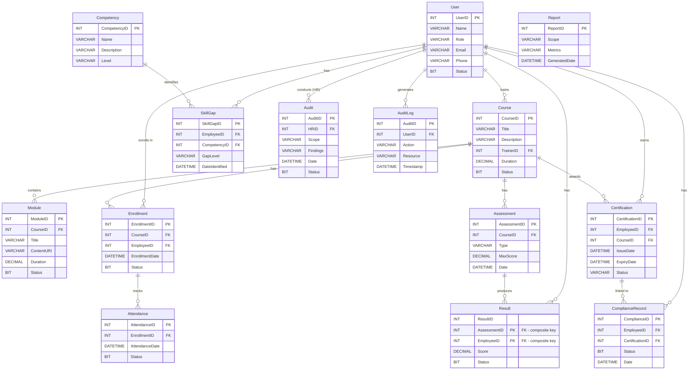

# SkillForge ER Diagram

```mermaid
erDiagram
    User {
        INT UserID PK
        VARCHAR Name
        VARCHAR Role
        VARCHAR Email
        VARCHAR Phone
        BIT Status
    }

    Course {
        INT CourseID PK
        VARCHAR Title
        VARCHAR Description
        INT TrainerID FK
        DECIMAL Duration
        BIT Status
    }

    Module {
        INT ModuleID PK
        INT CourseID FK
        VARCHAR Title
        VARCHAR ContentURI
        DECIMAL Duration
        BIT Status
    }

    Enrollment {
        INT EnrollmentID PK
        INT CourseID FK
        INT EmployeeID FK
        DATETIME EnrollmentDate
        BIT Status
    }

    Assessment {
        INT AssessmentID PK
        INT CourseID FK
        VARCHAR Type
        DECIMAL MaxScore
        DATETIME Date
    }

    Result {
        INT ResultID
        INT AssessmentID PK "FK - composite key"
        INT EmployeeID PK "FK - composite key"
        DECIMAL Score
        BIT Status
    }

    Certification {
        INT CertificationID PK
        INT EmployeeID FK
        INT CourseID FK
        DATETIME IssueDate
        DATETIME ExpiryDate
        VARCHAR Status
    }

    Attendance {
        INT AttendanceID PK
        INT EnrollmentID FK
        DATETIME AttendanceDate
        BIT Status
    }

    Competency {
        INT CompetencyID PK
        VARCHAR Name
        VARCHAR Description
        VARCHAR Level
    }

    SkillGap {
        INT SkillGapID PK
        INT EmployeeID FK
        INT CompetencyID FK
        VARCHAR GapLevel
        DATETIME DateIdentified
    }

    Report {
        INT ReportID PK
        VARCHAR Scope
        VARCHAR Metrics
        DATETIME GeneratedDate
    }

    Audit {
        INT AuditID PK
        INT HRID FK
        VARCHAR Scope
        VARCHAR Findings
        DATETIME Date
        BIT Status
    }

    AuditLog {
        INT AuditID PK
        INT UserID FK
        VARCHAR Action
        VARCHAR Resource
        DATETIME Timestamp
    }

    ComplianceRecord {
        INT ComplianceID PK
        INT EmployeeID FK
        INT CertificationID FK
        BIT Status
        DATETIME Date
    }

    User ||--o{ Course : "trains"
    User ||--o{ Enrollment : "enrolls in"
    User ||--o{ Result : "has"
    User ||--o{ Certification : "earns"
    User ||--o{ SkillGap : "has"
    User ||--o{ Audit : "conducts (HR)"
    User ||--o{ AuditLog : "generates"
    User ||--o{ ComplianceRecord : "has"

    Course ||--o{ Module : "contains"
    Course ||--o{ Assessment : "has"
    Course ||--o{ Enrollment : "has"
    Course ||--o{ Certification : "awards"

    Assessment ||--o{ Result : "produces"

    Enrollment ||--o{ Attendance : "tracks"

    Competency ||--o{ SkillGap : "identifies"

    Certification ||--o{ ComplianceRecord : "linked to"
```
